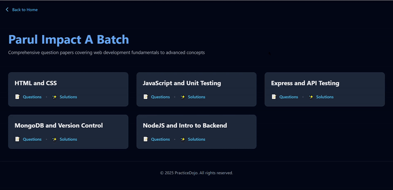

# Dojo

## About Dojo 🏆
Dojo is a platform designed to streamline access to research papers and academic materials. Our goal is to make knowledge easily accessible and organized for students, researchers, and enthusiasts.

## Features ✨
- 📚 **Access a wide range of research papers**
- 🔍 **Easy search and filtering options**
- 🚀 **Fast and user-friendly interface**
- 🌐 **Accessible from anywhere with an internet connection**

## Live Demo 🌍
Check out Dojo in action: [Dojo Website](https://dojo-steel.vercel.app)

### Home Page

### Papers Listing Page

## Contributing 🤝
We welcome contributions! If you’d like to contribute, please follow these steps:
1. Fork the repository
2. Create a new branch (`feature-xyz`)
3. Make your changes and commit them
4. Push to your fork and submit a Pull Request

For detailed guidelines, check our [Contribution Guide](./CONTRIBUTING.md).
## License 📜
This project is licensed under the MIT License - see the [LICENSE](./LICENSE) file for details.

## Maintainers 👨‍💻

|  |
| :------------------------------------------: |
| [Smaranjit Ghose](https://github.com/smaranjitghose/) |

## Contributors 🌟
A huge thanks to our contributors!

---

Enjoy using Dojo? Give us a ⭐ on GitHub!

