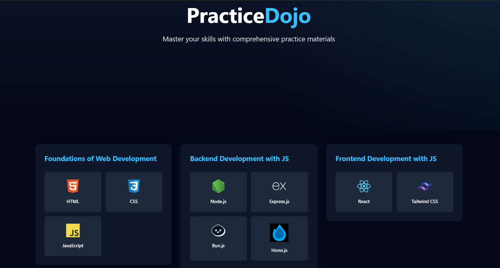

# **DOJO - Your Ultimate Resource for Development Learning!** 🚀

This repository provides a comprehensive collection of **question papers, study materials, and resources** for various **programming languages, frameworks, and development topics**. Whether you're preparing for exams, interviews, or just expanding your knowledge, DOJO has got you covered! 📚

## **What You Will Find:**
- Question papers on popular development languages and frameworks. 📝
- Study materials to help you grasp complex concepts. 📖
- Resources for preparing for technical interviews. 🔧
- A repository of tutorials and examples for hands-on learning. 👨‍💻

Feel free to contribute and add resources to help others learn and grow! 🌱

## A Quick Tour of Our Resources 🚀

### Home Page:

<video src="./readme_assets/HomePage.mp4">

### Question Paper Section:

<video src="./readme_assets/QuestionPaperSection.mp4">
